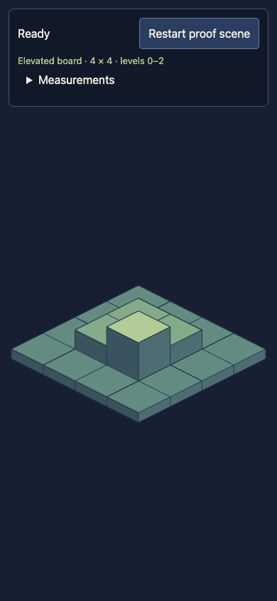
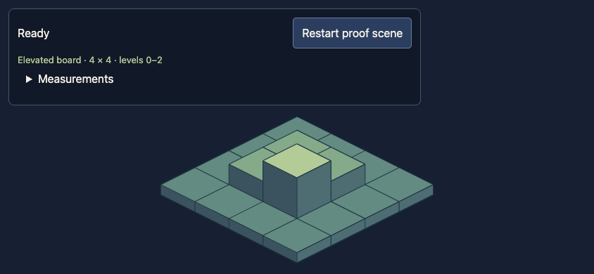

# Issue #15: elevated diagnostic board

## Scope and geometry

A fixed 4×4 diagnostic fixture has 16 unique integer coordinates in bounds and three elevation levels (0, 1, 2). It uses no external art, units, gameplay content catalog or procedural generation. Frozen tile records prevent accidental fixture mutation.

Pure TypeScript helpers project tile centers and construct exactly joined top/left/right faces. Each solid column extends to the same base; the renderer paints columns by increasing `x + y`, with coordinate tie-breaks, so nearer columns cover farther faces. Elevation changes surface geometry rather than draw priority. Named dimensions are 80×40, elevation step 24, base thickness 12. Board bounds include all side walls and negative projection coordinates.

Phaser draws generated shapes once and fits their transform to the viewport space below the diagnostics panel. Resize and panel-height changes update that transform; scene shutdown removes the resize callback and disconnects its panel observer. Board diagnostics expose tile count, elevations and actual graphics position/scale-derived bounds for browser assertions.

## Visual checks

Desktop Chromium screenshots at 390×844 and 844×390 were inspected. Tile tops join without visible holes, side faces connect to their top edges, nearer tiles cover farther walls correctly, and the elevation-1 platform/elevation-2 column are readable. The entire board is visible below the panel in both orientations at the default camera position. The browser suite repeats the orientation/restart checks under desktop and Pixel 7 portrait/landscape profiles, checking 16 tiles, elevations 0–2, viewport bounds, a single canvas and zero console/page errors.

## Validation

- RED: `npm run test:unit -- tests/unit/iso.test.ts` failed on the absent fixture/geometry modules. The desktop board browser test failed because the previous shell had no board diagnostics.
- Focused geometry: `npm run test:unit -- tests/unit/iso.test.ts` — 9 passed. Includes known origin/axis/elevation projections, shared edges, complete elevated columns, stable order under reversed input, fixture bounds/immutability, full face bounds and portrait/landscape/small viewport fits. Fit comparisons allow floating-point rounding tolerance only.
- Focused browser: `PLAYWRIGHT_CHROMIUM_EXECUTABLE='/Applications/Google Chrome.app/Contents/MacOS/Google Chrome' npm test -- tests/board.spec.ts` — 3 passed.
- Full unit: `npm run test:unit` — 12 passed.
- Strict type-check and production build: `npm run build` — passed; existing Phaser bundle-size warning remains.
- Full configured browser suite: `PLAYWRIGHT_CHROMIUM_EXECUTABLE='/Applications/Google Chrome.app/Contents/MacOS/Google Chrome' npm test` — 15 passed.
- `git diff --check` — passed.

These are Chromium/emulation checks. Physical-device proof remains in #20; selecting cells and camera gestures remain in #17, assets/occlusion in #16, and tactical maps/rules in later battle issues. The original #14 baseline remains historical evidence for the empty scene.
